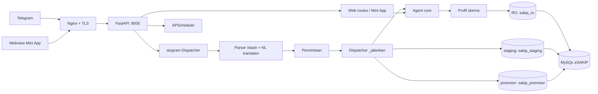

# SAKIP-Gen

> Agen AI **evaluator + drafter** SAKIP untuk pemerintah daerah — berjalan berdampingan dengan aplikasi web eSAKIP dan MySQL Anda, diakses lewat **bot Telegram** (perintah `/slash` **dan bahasa alami**) dan **Mini App** (webview).


SAKIP-Gen menilai akuntabilitas kinerja instansi (mengacu **PermenPAN-RB 88/2021**), menelusuri
seluruh siklus SAKIP (perencanaan → pengukuran → pelaporan → evaluasi → tindak lanjut), menemukan
*gap* berprioritas beserta estimasi kenaikan nilai, dan menyusun **usulan perbaikan indikator** —
dengan prinsip tegas: **keputusan dan pencatatan resmi tetap di tangan manusia**. Agen hanya
membaca data sumber; setiap perubahan melewati jalur staging yang disetujui dan tercatat di audit.

Inti pembeda v1.0: **satu tata bahasa perintah** (`Permintaan`) yang dipakai bersama oleh `/slash`
dan **penerjemah bahasa alami yang anti-halu** (LLM hanya menerjemahkan niat, bukan sumber jawaban),
ditambah **adapter profil skema** yang membuat SAKIP-Gen dapat ditanam di aplikasi eSAKIP mana pun
tanpa menyentuh kode inti.

---

## Daftar Isi
- [Fitur Utama](#fitur-utama)
- [Arsitektur](#arsitektur)
- [Prinsip Tata Kelola](#prinsip-tata-kelola)
- [Teknologi](#teknologi)
- [Struktur Proyek](#struktur-proyek)
- [Prasyarat](#prasyarat)
- [Mulai Cepat](#mulai-cepat)
- [Konfigurasi](#konfigurasi)
- [Pengujian](#pengujian)
- [Perintah Bot](#perintah-bot)
- [Bahasa Alami](#bahasa-alami)
- [Endpoint HTTP](#endpoint-http)
- [Basis Data dan Kredensial](#basis-data-dan-kredensial)
- [Profil Skema (multi-eSAKIP)](#profil-skema-multi-esakip)
- [Deployment](#deployment)
- [Dokumentasi](#dokumentasi)
- [Batasan](#batasan)
- [Kontribusi](#kontribusi)
- [Lisensi](#lisensi)

---

## Fitur Utama
- **Evaluasi LKE** satu OPD dengan model **PermenPAN-RB 88/2021** (Pengungkit 60 + Hasil 40):
  lima komponen berbobot — Perencanaan 18, Pengukuran 18, Pelaporan 9, Evaluasi Internal 15,
  Capaian Kinerja 40 — menghasilkan nilai total dan predikat **AA–D**. Bobot dapat dikalibrasi
  penuh via `LKE_BOBOT`.
- **Analisis gap** berprioritas dengan estimasi kenaikan nilai per komponen, plus **peringatan
  integritas** (mis. indikator dilabeli *outcome* tetapi rumusannya berbau *output*).
- **Siklus SAKIP lengkap** lewat verba khusus: `/rencana` (perencanaan + keselarasan/cascading
  pohon kinerja), `/capaian` (target vs realisasi **per periode** TW1–TW4/semester), `/laporan`
  (draft bahan LKjIP via LLM), `/temuan` (temuan → rekomendasi → tindak lanjut), `/dokumen`
  (telusur RPJMD/Renstra/PK/LKjIP + versi & bukti).
- **Bahasa alami anti-halu**: tulis "nilai dinas pendidikan triwulan 2 2026" — pipeline
  heuristik → LLM terstruktur → *grounding* OPD nyata → eksekusi; bila tak jelas, bot menjawab
  **klarifikasi sopan** (tidak pernah menampilkan error teknis).
- **Usulan perbaikan** indikator *output → outcome* (heuristik + penghalusan LLM
  Anthropic/Ollama, dengan *fallback* aman).
- **Alur persetujuan** lewat Telegram: ringkasan + tombol **Setujui/Tolak** dan **Mini App**
  (form edit) → disimpan ke staging `ai_usulan`.
- **Promosi teraudit** ke tabel sumber via `/terapkan` (khusus Kepala Dinas/Admin) dengan
  *optimistic lock*, *whitelist* kolom, dan jejak sebelum→sesudah di `ai_audit`.
- **Analitik lintas**: tren antar-tahun (`/tren`) dan benchmark/peringkat antar-OPD (`/benchmark`).
- **Menu Telegram per peran** (`setMyCommands` per scope): menu disesuaikan untuk
  operator/kepala_dinas/admin.
- **Adapter profil skema** (`reference` untuk demo/uji, `esakip` untuk skema nyata) — onboarding
  eSAKIP baru = menulis satu kelas profil, tanpa mengubah kode inti.
- **Push terjadwal**: ringkasan kinerja tiap awal triwulan (1 Jan/Apr/Jul/Okt, 07:00).
- **Hardening & observability**: security headers, rate limit API, throttle bot, perbandingan
  secret konstan-waktu, **event log** `ai_event`, dan metrik **Prometheus** di `GET /metrics`.

## Arsitektur

Satu proses FastAPI melayani healthcheck, webhook Telegram, dan Mini App; penjadwal berjalan
in-process. Baik `/slash` maupun kalimat bahasa alami menghasilkan objek **`Permintaan`** yang
sama, lalu dieksekusi oleh **satu dispatcher**. Rincian di [`docs/ARCHITECTURE.md`](docs/ARCHITECTURE.md).

## Prinsip Tata Kelola
Empat pilar yang memandu seluruh desain:

| # | Pilar |
|---|---|
| 1 | **MySQL satu-satunya sumber kebenaran**; tabel `ai_*` bersifat staging/turunan. |
| 2 | **Akses langsung agen hanya baca**; semua tulisan lewat jalur staging yang disetujui manusia. |
| 3 | **Pekerjaan agen dibatasi** pada evaluator + drafter; tidak menetapkan nilai resmi. |
| 4 | **Human-in-the-loop + audit sisi server**; Telegram adalah pemicu, bukan system of record. |

Pemisahan kewenangan diwujudkan lewat **tiga kredensial MySQL terpisah** dengan GRANT
*least-privilege* (bukan flag aplikasi). LLM hanya **menerjemahkan niat & menghaluskan rumusan**,
tidak pernah menjadi sumber angka/skor/temuan.

## Teknologi
- **Bahasa**: Python 3.11+ (CI pada 3.11/3.12; dikembangkan hingga 3.14)
- **Web/API**: FastAPI + Starlette, Gunicorn + UvicornWorker
- **Bot**: aiogram v3 (webhook/long-polling), Telegram Mini App (WebApp JS)
- **Basis data**: SQLAlchemy 2 (async) — `asyncmy` (produksi) / `aiosqlite` (uji/demo)
- **Validasi/konfig**: Pydantic v2, pydantic-settings
- **Penjadwalan**: APScheduler · **Token**: itsdangerous · **Template**: Jinja2
- **LLM (opsional)**: Anthropic SDK / Ollama — perumusan outcome & terjemahan niat
- **Observability**: metrik Prometheus internal (tanpa dependensi eksternal)

## Struktur Proyek
```
sakip-gen/
├── app.py                  # entrypoint FastAPI: webhook, Mini App, healthz/readyz/metrics
├── config.py               # Settings (.env) + audit_keamanan()
├── metrics.py              # counter Prometheus in-proses
├── demo_evaluasi.py        # demo evaluasi tanpa MySQL (SQLite in-memory)
├── dev_polling.py          # mode long-polling untuk pengembangan lokal
├── agent/                  # inti agen (logika murni, bebas skema fisik)
│   ├── permintaan.py       #   tata bahasa terpadu: dataclass Permintaan + enum slot
│   ├── nlu.py              #   penerjemah bahasa alami → Permintaan (heuristik + LLM)
│   ├── dosir.py            #   model Dosir Kinerja (Meta/Perencanaan/Pengukuran/…)
│   ├── evaluator.py        #   skoring LKE 88/2021 + predikat + gap + peringatan
│   ├── evaluasi.py         #   model Temuan + Rekomendasi (evaluasi internal)
│   ├── dokumen.py          #   model Dokumen (telusur berkas SAKIP)
│   ├── keselarasan.py      #   model RelasiKinerja (cascading pohon kinerja)
│   ├── improver.py         #   penyusun usulan (output→outcome) + penghalusan LLM
│   ├── usulan.py           #   model UsulanPerbaikan + hash_indikator
│   ├── analitik.py         #   tren, benchmark, keselarasan, indikator berisiko
│   ├── llm.py              #   klien Anthropic/Ollama (cache + circuit breaker + biaya)
│   └── service.py          #   orkestrasi: bangun-Dosir → evaluasi / capaian / temuan / dokumen
├── bot/                    # lapisan Telegram
│   ├── instance.py         #   Bot + Dispatcher + middleware
│   ├── handlers.py         #   /start, /help, /ping, fallback
│   ├── kinerja.py          #   verba data + dispatcher _jalankan + handler bahasa alami
│   ├── menu.py             #   setMyCommands per peran (per scope)
│   ├── auth.py             #   allowlist + RBAC + AuthMiddleware
│   ├── auth_sql.py         #   repo auth berbasis SQL (USE_SQL_AUTH=true)
│   ├── throttle.py         #   ThrottleMiddleware (laju per pengguna)
│   ├── audit_mw.py         #   AuditMiddleware (catat tiap perintah)
│   ├── format.py           #   pemformat pesan
│   └── scheduler.py        #   push ringkasan triwulanan
├── db/                     # lapisan data
│   ├── engines.py          #   engine RO/staging/promotor (3 kredensial, lazy)
│   ├── queries.py          #   bangun_dosir → delegasi ke profil aktif
│   ├── profiles/           #   adapter skema: base (Protocol), reference, esakip
│   ├── staging.py          #   ai_usulan (tulis/baca/putuskan/daftar)
│   ├── promote.py          #   terapkan ke sumber + ai_audit (4 pengaman)
│   ├── events.py           #   event log ai_event (dwi-sink)
│   ├── schema.py           #   MetaData Core tabel ai_* (Alembic-ready)
│   ├── ddl/                #   schema_referensi, staging, promote, events, auth (.sql)
│   └── mysql/              #   schema.sql + seed.sql + grants_esakip.sql (eSAKIP nyata)
├── web/                    # Mini App + keamanan HTTP
│   ├── routes.py           #   /usulan + /api/usulan/simpan + rate limit
│   ├── security.py         #   token opaque + validasi initData
│   ├── middleware.py       #   security headers + request-id + batas body
│   ├── health.py           #   readiness 3 engine (/readyz)
│   ├── ratelimit.py        #   SlidingWindowLimiter (in-memory/Redis)
│   └── templates/usulan.html
├── deploy/                 # artefak go-live (lihat deploy/DEPLOY.md)
├── docs/                   # dokumentasi lengkap (lihat di bawah)
└── tests/                  # suite uji (101 uji; SQLite in-memory + ASGI in-process)
```

## Prasyarat
- Python **3.11+**.
- Bot Telegram (token dari [@BotFather](https://t.me/BotFather)).
- (Produksi) MySQL 8 yang dipakai aplikasi eSAKIP, domain ber-HTTPS, dan Nginx.

## Mulai Cepat
```bash
# 1) Ekstrak/clone proyek
cd sakip-gen

# 2) Virtualenv + dependensi
python3 -m venv .venv && source .venv/bin/activate
pip install -r requirements.txt -r requirements-dev.txt

# 3) Jalankan pengujian (harus 101 passed; tanpa MySQL)
python -m pytest -q

# 4) Demo evaluasi TANPA MySQL (SQLite in-memory)
python demo_evaluasi.py
```

Menjalankan bot lokal (long-polling, tanpa HTTPS):
```bash
cp .env.example .env        # isi minimal BOT_TOKEN, WEBHOOK_SECRET, PUBLIC_BASE_URL
python dev_polling.py       # bot merespons /start, /help, verba data, & bahasa alami
```

## Konfigurasi
Konfigurasi dibaca dari `.env` (lihat [`docs/CONFIGURATION.md`](docs/CONFIGURATION.md) untuk
referensi lengkap). Yang **wajib**:

| Variabel | Keterangan |
|---|---|
| `BOT_TOKEN` | Token bot Telegram |
| `WEBHOOK_SECRET` | Secret path & header webhook (≥16 karakter) |
| `PUBLIC_BASE_URL` | URL publik, mis. `https://ai.contoh.id` |

Untuk fitur data/usulan, isi pula `DB_RO_URL`, `DB_STAGING_URL`, `DB_PROMOTE_URL`, `TOKEN_SECRET`,
serta `REGISTRATION_CODES` dan/atau `ADMIN_TELEGRAM_IDS`. Pilih skema sumber dengan
`DB_SCHEMA_PROFILE` (`reference`|`esakip`), aktifkan auth produksi dengan `USE_SQL_AUTH=true`, dan
hubungkan LLM dengan `ANTHROPIC_API_KEY` + `LLM_MODEL` (mis. `claude-haiku-4-5-20251001`).
Membuat secret acak:
```bash
python -c "import secrets;print(secrets.token_urlsafe(24))"
```

## Pengujian
```bash
python -m pytest -q          # seluruh suite, 101 uji
ruff check .                 # lint
mypy .                       # type-check
```
Pengujian tidak memerlukan MySQL (memakai SQLite in-memory + ASGI in-process); profil `esakip`
diuji dengan skema mini kompatibel-SQLite (penjaga *seam-drift*).

## Perintah Bot
Publik (tanpa daftar): `/start`, `/help`, `/ping`, `/daftar`. Selain itu memerlukan akun terdaftar;
akses OPD dibatasi `boleh_opd()`, promosi oleh `boleh_promosi()` (kepala_dinas/admin).

| Perintah | Fungsi |
|---|---|
| `/daftar <kode>` | Mendaftar dengan kode sekali-pakai (menu menyesuaikan peran) |
| `/status` | Akun, peran, OPD, hak promosi |
| `/opd` | Daftar/cari OPD (resolusi id/kode/nama) |
| `/evaluasi` \| `/nilai <opd> [tahun]` | Ringkasan evaluasi LKE (skor, predikat, gap) |
| `/gap <opd> [tahun]` | Daftar gap berprioritas |
| `/rencana <opd> [tahun] [dok]` | Perencanaan: sasaran, IKU, keselarasan/cascading |
| `/capaian <opd> [tahun]` | Target vs realisasi (per periode TW1–TW4/semester) |
| `/laporan <opd> [tahun]` | Draft bahan LKjIP (analisis capaian via LLM) |
| `/temuan <opd> [tahun]` | Temuan evaluasi internal + rekomendasi + tindak lanjut |
| `/dokumen <opd> [tahun] [jenis]` | Telusur dokumen SAKIP + versi & bukti |
| `/tren <opd> [tahun]` | Tren nilai antar-tahun |
| `/benchmark [tahun]` | Peringkat antar-OPD |
| `/usul <opd> [tahun]` | Buat draft usulan + tombol form/Setujui/Tolak |
| `/usulan <opd>` | Daftar usulan per OPD (status) |
| `/terapkan <usulan_id>` | Konfirmasi → terapkan usulan ke tabel sumber |

Detail (callback, format, menu per peran) di [`docs/INTERFACES.md`](docs/INTERFACES.md).

## Bahasa Alami
Selain `/slash`, pengguna dapat menulis kalimat biasa. Contoh: *"nilai dinas pendidikan triwulan 2
2026"*, *"lihat capaian opd 1"*, *"apa kelemahan DIKBUD"*, *"draft analisis LKjIP opd 1"*.
Pipeline anti-halu: **heuristik deterministik** (offline, selalu tersedia) → **LLM terstruktur**
(enum tertutup) → **grounding** (OPD diresolusi ke entitas nyata) → **eksekusi atau klarifikasi
sopan**. LLM tidak pernah mengeksekusi atau mengarang data; `/terapkan` **tidak** dapat dipicu
lewat bahasa alami (wajib `/slash` + konfirmasi).

## Endpoint HTTP
| Metode & path | Keterangan |
|---|---|
| `GET /healthz` | Status layanan + versi |
| `GET /readyz` | Kesiapan — cek koneksi 3 engine DB (503 bila ada yang gagal) |
| `GET /metrics` | Metrik Prometheus (text/plain) |
| `POST /webhook/<WEBHOOK_SECRET>` | Webhook Telegram (validasi secret konstan-waktu) |
| `GET /usulan?t=<token>` | Render form Mini App |
| `POST /api/usulan/simpan` | Simpan/Setujui usulan dari form (rate-limited) |
| `GET /docs`, `GET /redoc` | OpenAPI (FastAPI) |

## Basis Data dan Kredensial
Tiga kredensial MySQL berprinsip *least privilege*:

| Kredensial | Hak |
|---|---|
| `sakip_ro` | `SELECT` (analitik / penyusunan Dosir / telusur) |
| `sakip_staging` | `INSERT/SELECT/UPDATE` `ai_usulan`; `INSERT/SELECT` `ai_event` |
| `sakip_promotor` | `SELECT` + `UPDATE` kolom indikator yang diizinkan; `INSERT` `ai_audit` |

DDL tabel agen: `db/ddl/staging.sql`, `db/ddl/promote.sql`, `db/ddl/events.sql`, `db/ddl/auth.sql`.
Skema **sumber** ditangani oleh profil aktif (lihat di bawah). Skema & algoritma skoring dijelaskan
di [`docs/DATA_MODEL.md`](docs/DATA_MODEL.md).

## Profil Skema (multi-eSAKIP)
Logika agen hanya mengenal model domain (`DosirKinerja`, `Indikator`, `Temuan`, `Dokumen`,
`RelasiKinerja`, …). Setiap **profil** menerjemahkan skema fisik suatu aplikasi SAKIP ke/dari model
itu. Dipilih lewat `DB_SCHEMA_PROFILE`:

| Profil | Untuk | Kolom indikator yang dapat dipromosikan |
|---|---|---|
| `reference` | Demo & pengujian (skema mainan `db/ddl/schema_referensi.sql`) | `uraian`, `satuan`, `tipologi` |
| `esakip` | Skema eSAKIP nyata (`db/mysql/schema.sql`) | `uraian`, `tipologi` (`satuan` FK belum dipromosikan) |

Onboarding eSAKIP baru = menulis satu kelas profil yang memenuhi `SchemaProfile`
(`bangun_dosir`, `resolve_opd_id`, `daftar_opd`, `ambil_temuan`, `ambil_capaian`, `ambil_dokumen`,
`ambil_cascading`, `baca_indikator`, `terapkan_indikator`) — **tanpa** menyentuh kode inti.

## Deployment
Penyebaran satu VPS Ubuntu (gunicorn+UvicornWorker di belakang Nginx+TLS):
```bash
gunicorn app:app -c deploy/gunicorn.conf.py     # workers=1 (penjadwal & state laju in-process)
```
Runbook lengkap + checklist go-live: [`deploy/DEPLOY.md`](deploy/DEPLOY.md). Ringkas: salin ke
`/opt/sakip-gen` → `install.sh` → terapkan DDL (3 kredensial) → isi `.env` →
`python -m deploy.preflight` → `systemctl enable --now sakip-gen` → Nginx + `certbot` → webhook →
smoke test.

## Dokumentasi
| Dokumen | Isi |
|---|---|
| [`docs/EXECUTIVE_SUMMARY.md`](docs/EXECUTIVE_SUMMARY.md) | Ringkasan eksekutif & tata kelola |
| [`docs/ARCHITECTURE.md`](docs/ARCHITECTURE.md) | Arsitektur, dispatcher terpadu, NL pipeline, profil, peta modul |
| [`docs/DATA_MODEL.md`](docs/DATA_MODEL.md) | Model domain, skema DB, algoritma skoring 88/2021 |
| [`docs/INTERFACES.md`](docs/INTERFACES.md) | Perintah bot, bahasa alami, menu per peran, endpoint HTTP, Mini App |
| [`docs/USER_GUIDE.md`](docs/USER_GUIDE.md) | Panduan pengguna per peran (Kasubbag/Kadis/Evaluator) |
| [`docs/SECURITY.md`](docs/SECURITY.md) | RBAC, least-privilege, hardening, audit |
| [`docs/CONFIGURATION.md`](docs/CONFIGURATION.md) | Referensi seluruh variabel `.env` |
| [`docs/INSTALL.md`](docs/INSTALL.md) | Instalasi langkah demi langkah |
| [`deploy/DEPLOY.md`](deploy/DEPLOY.md) | Runbook go-live + checklist |
| [`CHANGELOG.md`](CHANGELOG.md) | Riwayat versi |

## Batasan
- **Skema sumber** harus dipetakan ke profil yang sesuai (`esakip` mengikuti `db/mysql/schema.sql`);
  eSAKIP dengan skema berbeda perlu profil baru.
- Penerapan otomatis baru tipe **`perbaikan_indikator`**; tipe lain (sasaran/target) menyusul.
- Skoring LKE adalah **aproksimasi transparan** — kalibrasi `LKE_BOBOT` ke instrumen LKE resmi
  sebelum dipakai keputusan; semua angka berlabel *estimasi indikatif*.
- Rate limit, throttle, penjadwal, dan menu **per-proses/satu worker**; multi-worker perlu store
  terpusat (Redis untuk rate limit sudah didukung via `REDIS_URL`).
- Auth in-memory hilang saat restart — gunakan `USE_SQL_AUTH=true` untuk produksi.

## Kontribusi
1. Buat branch fitur dari kondisi terbaru.
2. Jaga gaya kode (Indonesia, sesuai pola sekitar) dan **sertakan/perbarui pengujian**.
3. Pastikan `python -m pytest -q`, `ruff check .`, dan `mypy .` hijau sebelum mengajukan perubahan.
4. Untuk perubahan skema/keamanan/perintah, perbarui dokumen terkait di `docs/`.

## Lisensi
Proyek ini dirilis di bawah lisensi **MIT**. Lihat berkas [`LICENSE`](LICENSE) untuk detail lengkap.
