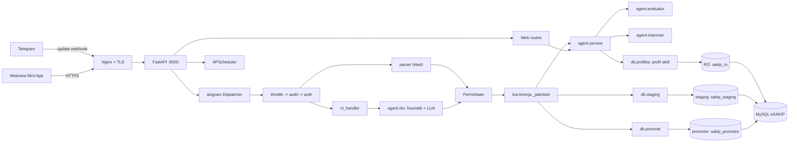
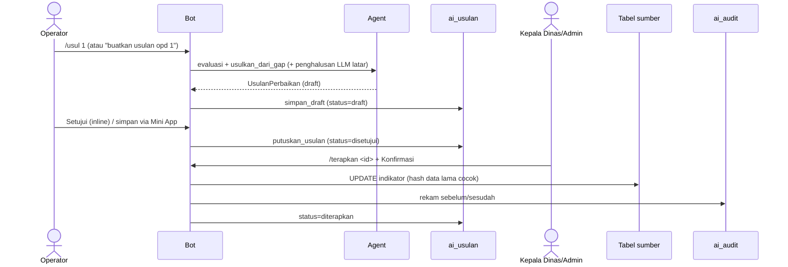

# SAKIP-Gen — Arsitektur (v1.0)

## 1. Gambaran
Satu proses FastAPI (`app:app`) melayani empat hal: **healthcheck/readiness**, **metrik
Prometheus**, **webhook Telegram**, dan **Mini App usulan**; sekaligus menjalankan **penjadwal**
(APScheduler) in-process. Bot Telegram ditangani aiogram v3 (webhook di produksi, long-polling di
dev). Akses data memakai SQLAlchemy 2 (async) dengan **tiga engine berkredensial terpisah** yang
mengakses skema sumber melalui **adapter profil**.

Ciri arsitektur v1.0: baik perintah `/slash` maupun **kalimat bahasa alami** menghasilkan objek
**`Permintaan`** yang sama, lalu dieksekusi oleh **satu dispatcher** (`_jalankan`).

## 2. Tiga mode otonomi = tiga kredensial
| Mode | Kredensial | Hak | Dipakai untuk |
|---|---|---|---|
| Baca | `sakip_ro` | `SELECT` | Menyusun Dosir, capaian, temuan, dokumen, cascading (analitik) |
| Staging | `sakip_staging` | `INSERT/SELECT/UPDATE` `ai_usulan`; `INSERT/SELECT` `ai_event` | Menyimpan usulan & event log |
| Promotor | `sakip_promotor` | `SELECT` + `UPDATE` kolom indikator diizinkan; `INSERT` `ai_audit` | Menerapkan usulan disetujui |

Pemisahan ini ditegakkan oleh GRANT MySQL (lihat `docs/SECURITY.md`), bukan oleh logika aplikasi
saja — sehingga **tidak ada jalur** bagi agen untuk menulis tabel sumber. Kolom yang dapat
dipromosikan ditentukan oleh `kolom_diizinkan` profil aktif (esakip: `{uraian, tipologi}`;
reference: `{uraian, satuan, tipologi}`).

## 3. Tata bahasa terpadu (`Permintaan`)
`agent/permintaan.py` mendefinisikan dataclass **`Permintaan`** — satu representasi untuk seluruh
permintaan: `aksi · opd_ref · tahun · periode · dokumen · level · fokus · skor`. Himpunan verba
(`AKSI_VALID`) bersifat **tertutup** (pondasi anti-halu): evaluasi, gap, usul, usulan, tren,
benchmark, status, daftar_opd, bantuan, terapkan, rencana, capaian, laporan, temuan, dokumen.
Helper kanonik (`kanonik_periode/dokumen/level`) menormalkan sinonim ke bentuk baku.

Dua jalur input menghasilkan `Permintaan` yang sama:
- **`/slash`** — parser posisional/flag di tiap handler `bot/kinerja.py`.
- **Bahasa alami** — `agent/nlu.parse()` (heuristik) dengan *fallback* `parse_llm()` (LLM
  terstruktur, enum tertutup).

## 4. Penerjemah bahasa alami — anti-halu (`agent/nlu.py`)
Pipeline berlapis, tiap lapis aman:
1. **Heuristik deterministik** (`parse`) — cepat, offline, selalu tersedia walau LLM mati.
2. **LLM terstruktur** (`parse_llm`) — hanya bila heuristik gagal & LLM tersedia; keluaran JSON
   ber-skema dengan `aksi` ber-enum (bukan prosa).
3. **Grounding** — `cocokkan_opd(ref, daftar_opd)` mewajibkan OPD resolusi ke entitas nyata.
4. **Putusan** di dispatcher — eksekusi, atau **klarifikasi sopan** (niat/OPD tak jelas), tanpa
   pernah menampilkan error teknis.

Prinsip kunci: **LLM hanya menerjemahkan niat & mengekstrak slot — tidak menjawab fakta, tidak
menilai, tidak mengeksekusi.** Seluruh angka/skor/daftar berasal dari evaluator + basis data.
Aksi destruktif (`terapkan`) **tidak** boleh dipicu lewat bahasa alami. Counter
`sakipgen_nlu_total{hasil=…}` memantau heuristik/llm/klarifikasi/tak_paham.

## 5. Adapter profil skema (`db/profiles/`)
Logika agen hanya mengenal model domain. Setiap **profil** memetakan skema fisik aplikasi SAKIP
ke/dari model itu, dipilih via `DB_SCHEMA_PROFILE`.

| Profil | Untuk | Skema acuan |
|---|---|---|
| `reference` | Demo & pengujian | `db/ddl/schema_referensi.sql` (skema mainan) |
| `esakip` | Produksi (eSAKIP nyata) | `db/mysql/schema.sql` |

Kontrak `SchemaProfile` (Protocol di `db/profiles/base.py`): `bangun_dosir`, `resolve_opd_id`,
`daftar_opd`, `ambil_temuan`, `ambil_capaian`, `ambil_dokumen`, `ambil_cascading`,
`baca_indikator`, `terapkan_indikator`. **Onboarding eSAKIP baru = menulis satu kelas profil**;
kode inti tak berubah. `db/queries.bangun_dosir` & `agent/service.*` mendelegasikan ke profil aktif
(`get_profile()`), dapat di-override untuk uji (`set_profile`).

## 6. Peta modul
| Berkas | Tanggung jawab |
|---|---|
| `app.py` | Entrypoint FastAPI: lifespan (webhook/menu/scheduler/audit keamanan), middleware HTTP, `/healthz`, `/readyz`, `/metrics`, webhook |
| `config.py` | `Settings` (pydantic-settings) + `audit_keamanan()` |
| `metrics.py` | Counter Prometheus in-proses (modul daun) |
| `agent/permintaan.py` | Dataclass `Permintaan` + enum slot + kanonisasi sinonim |
| `agent/nlu.py` | Penerjemah bahasa alami → `Permintaan` (heuristik + LLM + grounding) |
| `agent/dosir.py` | Model Pydantic Dosir Kinerja |
| `agent/evaluator.py` | Skoring LKE 88/2021 + predikat + gap + peringatan integritas |
| `agent/evaluasi.py` | Model `Temuan` + `Rekomendasi` (evaluasi internal) |
| `agent/dokumen.py` | Model `Dokumen` (telusur berkas SAKIP) |
| `agent/keselarasan.py` | Model `RelasiKinerja` (cascading pohon kinerja) |
| `agent/improver.py` | Penyusun usulan output→outcome + penghalusan LLM |
| `agent/usulan.py` | Model `UsulanPerbaikan` + `hash_indikator` |
| `agent/analitik.py` | `tren_opd`, `benchmark_opd`, `keselarasan_sasaran`, `indikator_berisiko` |
| `agent/llm.py` | Klien Anthropic/Ollama (cache + circuit breaker + log biaya) + `jawab_singkat`/`llm_tersedia` |
| `agent/service.py` | Orkestrasi: `evaluasi_opd`, `capaian_periode`, `temuan_opd`, `dokumen_opd`, `cascading_opd` |
| `db/engines.py` | Engine RO/staging/promotor (lazy + override uji) |
| `db/queries.py` | `bangun_dosir` → delegasi profil aktif |
| `db/profiles/*` | Adapter skema: `base` (Protocol), `reference`, `esakip` |
| `db/staging.py` | Tulis/baca/putuskan/daftar usulan (`ai_usulan`) |
| `db/promote.py` | Terapkan usulan ke sumber + audit (`ai_audit`) |
| `db/events.py` | Event log dwi-sink (`ai_event`) |
| `db/schema.py` | MetaData Core tabel `ai_*` (Alembic-ready) |
| `bot/instance.py` | Bot & Dispatcher + registrasi middleware/router |
| `bot/handlers.py` | `/start`, `/help`, `/ping`, fallback |
| `bot/kinerja.py` | Verba data + dispatcher `_jalankan` + `nl_handler` + callback |
| `bot/menu.py` | `setMyCommands` per peran (per scope) |
| `bot/auth.py` / `bot/auth_sql.py` | Allowlist + RBAC + `AuthMiddleware`; repo in-memory atau SQL |
| `bot/throttle.py` | `ThrottleMiddleware` (laju per pengguna) |
| `bot/audit_mw.py` | `AuditMiddleware` (catat tiap perintah) |
| `bot/format.py` | Pemformat ringkasan/gap (HTML Telegram) |
| `bot/scheduler.py` | Push ringkasan triwulanan (APScheduler) |
| `web/routes.py` | `/usulan` (form) + `/api/usulan/simpan` (Gerbang) + rate limit |
| `web/security.py` | Token opaque (itsdangerous) + validasi `initData` |
| `web/middleware.py` | Security headers + request-id/access-log + batas body |
| `web/health.py` | Readiness 3 engine (`/readyz`) |
| `web/ratelimit.py` | `SlidingWindowLimiter` + kunci klien (in-memory/Redis) |
| `deploy/*` | systemd, gunicorn, Nginx, skrip webhook/preflight, runbook |

## 7. Middleware
**Bot (aiogram), urutan eksekusi:** `ThrottleMiddleware` → `AuditMiddleware` → `AuthMiddleware`
→ handler. Throttle menjatuhkan spam lebih dulu; audit mencatat percobaan (termasuk yang belum
terdaftar); auth menyuntikkan `data["user"]` dan memblokir non-publik. `kinerja_router` didaftarkan
sebelum `base_router` agar perintah spesifik & `nl_handler` menang atas fallback.

**HTTP (Starlette):** `RequestContextMiddleware` (request-id, access-log durasi, batas ukuran body
→ 413) di lapisan luar; `SecurityHeadersMiddleware` (CSP, nosniff, dll) di dalamnya.

## 8. Alur utama
### 8.1 Evaluasi & siklus baca (`/nilai`, `/gap`, `/rencana`, `/capaian`, `/temuan`, `/dokumen`)
`bot.kinerja._jalankan` → `agent.service.*` (RO via profil aktif) → evaluator/format → kirim.
`/capaian` periode≠tahunan memanggil `capaian_periode` (fallback tahunan + catatan bila kosong);
`/rencana` memakai `cascading_opd` (fallback heuristik `keselarasan_sasaran`).

### 8.2 Bahasa alami
`nl_handler` → `nlu.parse` → (bila gagal & LLM ada) `nlu.parse_llm` → `_jalankan`. Bila tetap
gagal → `_klarifikasi_tak_paham`. OPD tak ter-resolusi → `_tanya_opd`.

### 8.3 Usul → Setujui → Terapkan

## 9. Observability
- `GET /metrics` — counter Prometheus: `sakipgen_evaluasi_total`, `sakipgen_usulan_total`,
  `sakipgen_penerapan_total{hasil}`, `sakipgen_llm_total{hasil}`, `sakipgen_nlu_total{hasil}`,
  `sakipgen_error_total`.
- `GET /readyz` — cek koneksi engine RO/staging/promotor (503 bila ada yang gagal).
- Event log `ai_event` (dwi-sink: logger + DB best-effort) mencatat aksi penting.

## 10. Proses & deployment
Satu worker gunicorn+UvicornWorker (`workers=1`) karena penjadwal in-process serta
limiter/throttle/menu per-proses. Untuk skala lebih besar: pisahkan penjadwal ke service tersendiri
(`ENABLE_SCHEDULER=false` di web; lihat `scheduler_service.py`) dan pakai Redis untuk limiter
(`REDIS_URL`). Topologi & langkah lengkap di `deploy/DEPLOY.md`.
