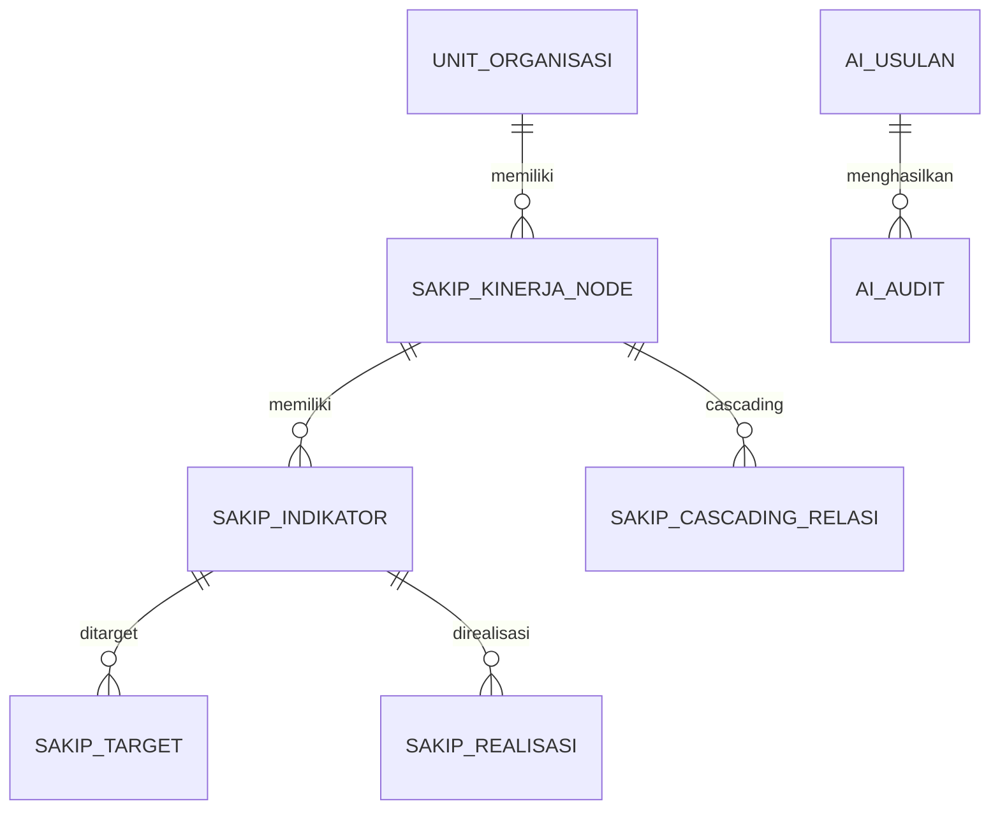

# SAKIP-Gen — Model Data & Algoritma (v1.0)

## 1. Model domain (Pydantic/dataclass)
Logika agen hanya mengenal model domain ini; pemetaan ke skema fisik ditangani **profil**
(lihat §3).

### Dosir Kinerja (`agent/dosir.py`)
- `Meta(instansi, opd_id, tahun, dibuat_pada)`
- `Perencanaan.sasaran_strategis: [SasaranStrategis(kode, uraian, indikator[])]`
- `Indikator(indikator_id, uraian, satuan, tipologi)` — `tipologi ∈ {input, proses, output,
  outcome, impact}`. `indikator_id` berisi **identitas indikator menurut profil**: pada `reference`
  = KODE (mis. `IKU-1.1`), pada `esakip` = **PK** `sakip_indikator.id` (string, stabil).
- `Pengukuran.capaian: [Capaian(indikator_id, target, realisasi, persen_capaian)]`
- `Pelaporan(ada_lkjip, ada_analisis_capaian, ada_analisis_efisiensi)`
- `EvaluasiInternal(ada_evaluasi_internal, ada_tindak_lanjut)`

### Hasil Evaluasi (`agent/evaluator.py`)
- `NilaiKomponen(nama, bobot, skor, kontribusi)`
- `GapTemuan(komponen, deskripsi, estimasi_poin, detail[])`
- `HasilEvaluasi(instansi, tahun, komponen[], nilai_total, predikat, keterangan_predikat, gap[],
  peringatan[])` — `peringatan` memuat catatan integritas data (mis. indikator dilabeli *outcome*
  tetapi rumusannya berbau *output*).

### Evaluasi internal (`agent/evaluasi.py`)
- `Rekomendasi(uraian, prioritas, status, tindak_lanjut, progres)`
- `Temuan(uraian, jenis, tingkat_risiko, rekomendasi[])` — dibaca via `profil.ambil_temuan`.

### Dokumen (`agent/dokumen.py`)
- `Dokumen(jenis, nama_jenis, judul, status, tahun, nomor, jumlah_versi, versi_terakhir,
  jumlah_bukti)` — dibaca via `profil.ambil_dokumen` (penanda kelengkapan; bukan isi dokumen).

### Keselarasan / cascading (`agent/keselarasan.py`)
- `RelasiKinerja(parent, child, jenis, bobot, arah)` — `arah ∈ {naik, turun}` relatif OPD
  (naik = kontribusi ke kinerja atasan/Pemda; turun = diturunkan ke unit/eselon). Dibaca via
  `profil.ambil_cascading`.

### Usulan (`agent/usulan.py`)
- `PerubahanField(field, lama, usulan)`
- `UsulanPerbaikan(id, tipe="perbaikan_indikator", instansi, opd_id, level, unit, indikator_id,
  tahun, perubahan[], alasan, gap_lke, estimasi_poin, hash_data_lama, status, disusun_oleh,
  ditinjau_oleh, diterapkan_oleh, diterapkan_pada)`
  - `level ∈ {dinas, bidang, seksi}`; `status ∈ {draft, disetujui, ditolak, diterapkan}`.
- `hash_indikator(ind)` = SHA-256 dari `{indikator_id, uraian, satuan, tipologi}` (urut kunci) —
  dasar **optimistic lock**.

### Permintaan (`agent/permintaan.py`)
- `Permintaan(aksi, opd_ref, tahun, periode, dokumen, level, fokus, skor)` — satu representasi
  untuk `/slash` & bahasa alami. `aksi ∈ AKSI_VALID` (tertutup); `periode ∈ {tahunan, tw1..tw4,
  smt1, smt2}`; `dokumen ∈ {rpjmd, renstra, renja, rkpd, pk, pohon, lkjip, lhe}`;
  `level ∈ {pemda, opd, unit, individu}`.

## 2. Skema basis data milik agen
- **`ai_usulan`** (`db/ddl/staging.sql`): staging usulan. Kolom inti: `id, tipe, instansi, opd_id,
  level, unit, indikator_id, tahun, payload(JSON), gap_lke, estimasi_poin, hash_data_lama,
  status, disusun_oleh, ditinjau_oleh, dibuat_pada, diputuskan_pada, diterapkan_oleh,
  diterapkan_pada`. Stempel waktu = string ISO-8601 UTC.
- **`ai_audit`** (`db/ddl/promote.sql`): jejak perubahan data sumber. `id, usulan_id, aksi,
  tabel_sasaran, kunci, data_sebelum(JSON), data_sesudah(JSON), oleh, pada`.
- **`ai_event`** (`db/ddl/events.sql`): event log aktivitas/keamanan. `id, pada, kategori, aksi,
  telegram_id, nama, peran, opd_id, status, ringkas, request_id, detail(JSON)`.
- **Auth SQL** (`db/ddl/auth.sql`, opsional `USE_SQL_AUTH=true`): pengguna terdaftar & kode
  pendaftaran.

Definisi Core `MetaData` tabel `ai_*` ada di `db/schema.py` (siap Alembic).

## 3. Profil skema sumber (`db/profiles/`)
`bangun_dosir` & fungsi `agent/service.*` mendelegasikan ke profil aktif (`DB_SCHEMA_PROFILE`).

### 3.1 Profil `reference` (`db/ddl/schema_referensi.sql`) — demo/uji
`opd(id, kode, nama)` · `sasaran_strategis(id, opd_id, tahun, kode, uraian)` ·
`indikator(id, sasaran_id, kode, uraian, satuan, tipologi)` ·
`capaian_kinerja(id, indikator_id, opd_id, tahun, target, realisasi)` ·
`pelaporan_meta(opd_id, tahun, ada_lkjip, ada_analisis_capaian, ada_analisis_efisiensi,
ada_evaluasi_internal, ada_tindak_lanjut)`. Tak punya modul temuan/dokumen/cascading/periodik →
`ambil_temuan/ambil_capaian/ambil_dokumen/ambil_cascading` mengembalikan `[]`. Promosi:
`{uraian, satuan, tipologi}`.

### 3.2 Profil `esakip` (`db/mysql/schema.sql`) — produksi
Pemetaan ke model Dosir:

| Domain | Sumber eSAKIP |
|---|---|
| OPD | `unit_organisasi` (`level_unit='OPD'`) |
| Sasaran | `sakip_kinerja_node` (`jenis_node ∈ {SASARAN_OPD, TUJUAN_OPD}`, `status='AKTIF'`, tahun dalam rentang) |
| Indikator | `sakip_indikator` (`indikator_id = id`; `tipologi = jenis_indikator`; `satuan ← ref_satuan`) |
| Capaian tahunan | `sakip_target` + `sakip_realisasi` (`periode='TAHUNAN'`) |
| Capaian periode | idem dengan `periode ∈ {TRIWULAN_1..4, SEMESTER_1..2}` (`ambil_capaian`) |
| Pelaporan | `lkjip_dokumen` + `lkjip_capaian` (narasi analisis/efisiensi) |
| Eval internal | `evaluasi_akip`/`evaluasi_unit` + rantai `evaluasi_temuan→rekomendasi→tindak_lanjut` |
| Temuan | `evaluasi_temuan ⋈ rekomendasi ⋈ tindak_lanjut` (`ambil_temuan`) |
| Dokumen | `dokumen ⋈ ref_dokumen_jenis` + hitung `dokumen_versi`/`dokumen_bukti` (`ambil_dokumen`) |
| Cascading | `sakip_cascading_relasi ⋈ sakip_kinerja_node` (`ambil_cascading`) |

Promosi: field Dosir `{uraian→nama, tipologi→jenis_indikator}` (`satuan` FK belum dipromosikan),
identitas memakai PK `sakip_indikator.id`.

## 4. Algoritma skoring LKE — PermenPAN-RB 88/2021 (`agent/evaluator.py`)
Model **Pengungkit 60 + Hasil 40**. Bobot default (dapat dikalibrasi penuh via `LKE_BOBOT`):

| Komponen | Kelompok | Bobot | Rumus skor (0–100) |
|---|---|---|---|
| Perencanaan Kinerja | Pengungkit | 18 | `40 + 60 × (n_hasil / n)`; `n_hasil` = indikator `outcome`/`impact` |
| Pengukuran Kinerja | Pengungkit | 18 | `100 × (m / n)`; `m` = indikator dengan `target` **dan** `realisasi` |
| Pelaporan Kinerja | Pengungkit | 9 | `50·ada_lkjip + 30·ada_analisis_capaian + 20·ada_analisis_efisiensi` |
| Evaluasi Akuntabilitas Kinerja Internal | Pengungkit | 15 | `60·ada_evaluasi_internal + 40·ada_tindak_lanjut` |
| Capaian Kinerja | Hasil | 40 | rata-rata `persen_capaian` (di-cap 100%; indikator tak terukur = 0) |

Bobot Pengungkit (18/18/9/15) berasal dari **split komponen AKIP baku 30/30/15/25** yang diskalakan
ke envelope 60% (×0,6). **Pengukuran vs Capaian dipisah**: Pengukuran menilai *kelengkapan proses*
(apakah diukur), Capaian menilai *tingkat pencapaian aktual* (realisasi vs target).

- `kontribusi = skor × bobot / 100`; `nilai_total = Σ kontribusi`.
- **Estimasi gap** per komponen `= bobot/100 × Δskor` (potensi kenaikan bila gap ditutup); gap
  diurutkan menurun berdasarkan `estimasi_poin`.
- **Peringatan integritas**: indikator bertipologi `outcome/impact` yang rumusannya diawali kata
  khas output (jumlah, tersedianya, terlaksananya, …) ditandai untuk verifikasi.

**Predikat** (`predikat_dari_nilai`, sesuai 88/2021): `>90` AA (Sangat Memuaskan) · `>80` A
(Memuaskan) · `>70` BB (Sangat Baik) · `>60` B (Baik) · `>50` CC (Cukup/Memadai) · `>30` C
(Kurang) · selain itu D (Sangat Kurang).

> Skoring ini **aproksimasi transparan**, bukan rubrik LKE resmi. Kalibrasikan `LKE_BOBOT` terhadap
> instrumen PermenPAN-RB 88/2021 / praktik Tim Penilai sebelum dipakai untuk keputusan. Semua angka
> berlabel *estimasi indikatif*.

## 5. Estimasi usulan (`agent/improver.py`)
Mengubah satu indikator output → outcome menaikkan sub-skor Perencanaan sebesar `60/n`, sehingga
kontribusi ≈ `(bobot Perencanaan/100) × 60 × (1/n)`. Dengan bobot 18 dan `n=4` → `18/100 × 60/4`
= **+2,7** poin per indikator. `_rumusan_outcome` heuristik; `sempurnakan_dengan_llm` menghaluskan
via Anthropic/Ollama dengan *fallback* heuristik.

## 6. Optimistic lock (anti data basi)
Saat usulan dibuat, `hash_data_lama = hash_indikator(indikator_saat_ini)`. Sebelum menyimpan
(form) maupun menerapkan (`/terapkan`), sistem menghitung ulang hash dari data sumber terkini
(`profil.baca_indikator`); bila berbeda → **ditolak** (HTTP 409 di web / pesan gagal di bot) agar
tidak menimpa perubahan yang terjadi setelah usulan disusun. Penerapan memakai *whitelist*
`kolom_diizinkan` profil + audit sebelum→sesudah dalam satu transaksi.
