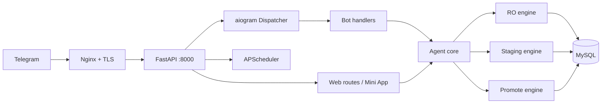

# SAKIP-Gen — Ringkasan Eksekutif (v1.0)

**SAKIP-Gen** adalah agen AI **evaluator + drafter** untuk Sistem Akuntabilitas Kinerja
Instansi Pemerintah (SAKIP) di pemerintah daerah. Ia berjalan di satu VPS Ubuntu
**berdampingan** dengan aplikasi web eSAKIP dan basis data MySQL yang sudah ada, dan diakses
melalui **bot Telegram** (perintah `/slash` **dan bahasa alami**) serta **Telegram Mini App**
(form usulan).

> Status: **v1.0** — rilis publik perdana yang mengonsolidasikan seluruh fase pengembangan + refactor
> perintah terpadu, **101 pengujian otomatis lulus**, siap go-live.

## 1. Masalah yang dijawab
Evaluasi AKIP (mengacu PermenPAN-RB 88/2021) bersifat manual, lambat, dan tidak konsisten.
OPD sering tidak tahu **di mana letak gap** dan **berapa potensi kenaikan nilai** bila gap
ditutup. SAKIP-Gen memberi penilaian heuristik yang transparan, mengidentifikasi gap
berprioritas, dan menyusun **usulan perbaikan indikator** — sambil memastikan keputusan dan
pencatatan resmi tetap di tangan manusia.

## 2. Empat pilar tata kelola (non-negosiabel)
1. **MySQL satu-satunya sumber kebenaran.** Dosir Kinerja & tabel `ai_*` bersifat turunan/staging.
2. **Akses langsung agen hanya baca (read-only).** Semua tulisan melewati jalur staging yang
   disetujui manusia; agen **tidak pernah** menulis tabel sumber.
3. **Pekerjaan agen dibatasi:** hanya evaluator + drafter. Agen tidak menetapkan nilai resmi.
4. **Human-in-the-loop + audit sisi server.** Telegram adalah pemicu, **bukan** system of record.

Pemisahan kewenangan diwujudkan lewat **tiga kredensial MySQL terpisah** (read-only / staging /
promotor), bukan sekadar flag konfigurasi.

## 3. Kemampuan v1.0
- **Evaluasi LKE PermenPAN-RB 88/2021** satu OPD: model Pengungkit 60 + Hasil 40 — lima komponen
  (Perencanaan 18, Pengukuran 18, Pelaporan 9, Evaluasi Internal 15, Capaian 40), nilai total,
  predikat (AA–D); bobot dapat dikalibrasi via `LKE_BOBOT`.
- **Analisis gap** berprioritas + estimasi kenaikan nilai, plus **peringatan integritas** indikator.
- **Siklus SAKIP lengkap**: `/rencana` (keselarasan/cascading pohon kinerja), `/capaian` (per
  periode TW/semester), `/laporan` (draft LKjIP), `/temuan` (temuan→rekomendasi→tindak lanjut),
  `/dokumen` (telusur berkas + versi & bukti), plus `/tren` & `/benchmark`.
- **Bahasa alami anti-halu**: heuristik → LLM terstruktur → grounding → eksekusi/klarifikasi sopan;
  LLM hanya menerjemahkan niat, tidak pernah mengarang angka.
- **Usulan perbaikan** indikator output → outcome (heuristik + penghalusan LLM Anthropic/Ollama).
- **Alur persetujuan**: bot mengirim ringkasan + tombol **Setujui/Tolak** dan **Mini App** (form
  edit). Usulan disimpan ke staging `ai_usulan`.
- **Promosi teraudit** ke tabel sumber lewat `/terapkan` (khusus Kepala Dinas/Admin), dengan
  *optimistic lock*, *whitelist* kolom, dan jejak sebelum/sesudah di `ai_audit`.
- **Adapter profil skema** (`reference`/`esakip`): dapat ditanam di aplikasi eSAKIP mana pun dengan
  menulis satu kelas profil; **menu Telegram per peran**; **push terjadwal** awal triwulan.
- **Hardening & observability**: security headers, rate limit API, throttle bot, perbandingan
  secret konstan-waktu, **event log** `ai_event`, metrik **Prometheus** (`/metrics`), `/readyz`.

## 4. Yang sengaja TIDAK dilakukan (batas sistem)
- Tidak menetapkan/mengubah nilai SAKIP resmi secara otomatis.
- Tidak menulis tabel sumber tanpa persetujuan manusia berwenang.
- Tidak menjadi pengganti rubrik LKE resmi (skor bersifat **approksimasi** yang perlu kalibrasi).
- Tidak mendorong data sensitif (NIK/SKP) melewati Telegram (pertimbangan UU ITE).

## 5. Arsitektur singkat

Rincian di `docs/ARCHITECTURE.md`.

## 6. Kualitas & status
- Versi aplikasi **1.0.0**; FastAPI + aiogram v3 + SQLAlchemy 2 (async) + Pydantic.
- **101 pengujian** lulus (SQLite in-memory + ASGI in-process, tanpa MySQL); `ruff` bersih.
  Profil `esakip` diuji dengan skema mini kompatibel-SQLite (penjaga *seam-drift*).
- Penghalusan rumusan & terjemahan niat memakai LLM Anthropic/Ollama (opsional, aman-gagal).

## 7. Batasan & roadmap
- **Skema sumber** dipetakan oleh profil aktif; profil `esakip` mengikuti `db/mysql/schema.sql` —
  eSAKIP berskema berbeda perlu profil baru (satu kelas di `db/profiles/`).
- **Auth in-memory** hilang saat restart — aktifkan `USE_SQL_AUTH=true` untuk produksi.
- Skoring LKE adalah **aproksimasi transparan** — kalibrasi `LKE_BOBOT` ke instrumen resmi sebelum
  dipakai keputusan; semua angka berlabel *estimasi indikatif*.
- Penerapan otomatis baru mendukung tipe **`perbaikan_indikator`**; tipe lain (sasaran/target) menyusul.
- Satu worker (penjadwal/limiter/menu in-process); rate-limit lintas worker via `REDIS_URL`.

## 8. Peta dokumen
| Dokumen | Isi |
|---|---|
| `docs/EXECUTIVE_SUMMARY.md` | Ringkasan eksekutif (dokumen ini) |
| `docs/ARCHITECTURE.md` | Arsitektur, komponen, alur, peta modul |
| `docs/DATA_MODEL.md` | Model domain, skema DB, algoritma skoring |
| `docs/INTERFACES.md` | Perintah bot, bahasa alami, menu per peran, endpoint HTTP, Mini App |
| `docs/USER_GUIDE.md` | Panduan pengguna per peran |
| `docs/SECURITY.md` | Model keamanan, RBAC, least-privilege, audit |
| `docs/CONFIGURATION.md` | Referensi seluruh variabel `.env` |
| `docs/INSTALL.md` | Instalasi langkah demi langkah |
| `deploy/DEPLOY.md` | Runbook go-live + checklist |
