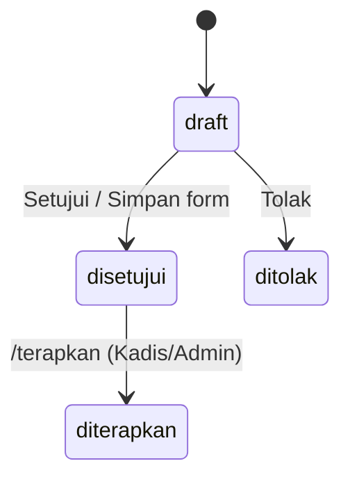

# SAKIP-Gen — Panduan Pengguna (v1.0)

Panduan ini untuk **pengguna bot** SAKIP-Gen di Telegram: Kasubbag Perencanaan/operator OPD,
Kepala Dinas, dan Evaluator Kabupaten/admin. Anda akan belajar mendaftar, menelusuri seluruh siklus
SAKIP (perencanaan → pengukuran → pelaporan → evaluasi → tindak lanjut), melihat gap, menyusun &
menyetujui usulan perbaikan, dan (bagi yang berwenang) menerapkannya ke data resmi — lewat perintah
`/slash` maupun **bahasa biasa**.

> Untuk instalasi lihat [`INSTALL.md`](INSTALL.md); untuk arsitektur/keamanan lihat folder `docs/`.

## Daftar Isi
- [Memulai](#memulai)
- [Peran dan Akses](#peran-dan-akses)
- [Ringkasan Perintah](#ringkasan-perintah)
- [Bahasa Alami](#bahasa-alami)
- [Mengevaluasi Kinerja](#mengevaluasi-kinerja)
- [Melihat Gap Prioritas](#melihat-gap-prioritas)
- [Menelusuri Siklus SAKIP](#menelusuri-siklus-sakip)
- [Menyusun Usulan Perbaikan](#menyusun-usulan-perbaikan)
- [Form Mini App](#form-mini-app)
- [Status Usulan](#status-usulan)
- [Menerapkan ke Data Resmi](#menerapkan-ke-data-resmi)
- [Laporan Terjadwal](#laporan-terjadwal)
- [Etiket Data dan Batasan](#etiket-data-dan-batasan)
- [Tanya Jawab dan Pemecahan Masalah](#tanya-jawab-dan-pemecahan-masalah)

## Memulai
1. Buka bot di Telegram (username diberikan admin) dan kirim **/start**. Bot membalas perkenalan.
2. **Mendaftar** dengan kode dari admin:
   ```
   /daftar KADIS-2026
   ```
   Jika berhasil, bot menampilkan nama, peran, dan OPD Anda, lalu **menu perintah disesuaikan dengan
   peran** Anda. Jika kode salah/sudah dipakai, bot meminta kode lain. Kode bersifat **sekali pakai**.

> Sebelum terdaftar, hanya `/start`, `/help`, `/ping`, dan `/daftar` yang dapat dipakai.

## Peran dan Akses
| Peran | Persona | Yang dapat dilakukan |
|---|---|---|
| **operator** | Kasubbag Perencanaan / staf | Telusur siklus, evaluasi, gap, menyusun & menyetujui usulan |
| **kepala_dinas** | Kepala Dinas | Semua di atas **+ menerapkan** usulan ke data resmi (`/terapkan`) + benchmark |
| **admin** | Evaluator Kabupaten / Admin | Semua OPD + evaluasi, temuan, dokumen, benchmark, terapkan |

- Akses dibatasi per **OPD**; admin dapat mengakses semua OPD.
- Cek hak Anda kapan saja dengan **/status** (peran, OPD, hak menerapkan).
- Daftar/cari OPD dengan **/opd** (mendukung id/kode/nama).

## Ringkasan Perintah
| Perintah | Fungsi |
|---|---|
| `/start`, `/help`, `/ping` | Perkenalan, bantuan, cek bot |
| `/daftar <kode>` | Mendaftar dengan kode |
| `/status`, `/opd` | Akun & hak · daftar/cari OPD |
| `/nilai` (`/evaluasi`) `<opd> [tahun]` | Ringkasan evaluasi LKE (skor, predikat, gap) |
| `/gap <opd> [tahun]` | Daftar gap prioritas |
| `/rencana <opd> [tahun] [dok]` | Perencanaan: sasaran, IKU, keselarasan/cascading |
| `/capaian <opd> [tahun]` | Target vs realisasi (per periode TW/semester) |
| `/laporan <opd> [tahun]` | Draft bahan LKjIP (analisis capaian) |
| `/temuan <opd> [tahun]` | Temuan evaluasi internal + rekomendasi + tindak lanjut |
| `/dokumen <opd> [tahun] [jenis]` | Telusur dokumen SAKIP + versi & bukti |
| `/tren <opd> [tahun]` · `/benchmark [tahun]` | Tren antar-tahun · peringkat antar-OPD |
| `/usul <opd> [tahun]` | Susun usulan + tombol form/Setujui/Tolak |
| `/usulan <opd>` | Daftar usulan beserta status |
| `/terapkan <usulan_id>` | (Kadis/Admin) Terapkan usulan ke data resmi |

> Menu perintah Telegram (tombol "/") otomatis menampilkan perintah yang relevan untuk peran Anda.
> `tahun` boleh dikosongkan (memakai tahun berjalan); `opd` berupa angka pada `/slash`.

## Bahasa Alami
Tidak harus hafal perintah — tulis saja kalimat biasa:
```
nilai dinas pendidikan triwulan 2 2026
capaian opd 1
apa kelemahan DIKBUD
lihat pohon kinerja opd 1
draft analisis LKjIP opd 1
bandingkan OPD 2026
```
SAKIP-Gen menerjemahkan maksud Anda ke perintah yang tepat. Bila belum jelas, bot **bertanya dengan
sopan** ("OPD mana yang Anda maksud?") — bukan menampilkan pesan error. Semua angka tetap berasal
dari basis data, bukan karangan AI. Catatan keamanan: **penerapan ke data resmi (`/terapkan`) tidak
bisa lewat bahasa alami** — wajib perintah `/terapkan` + konfirmasi.

## Mengevaluasi Kinerja
Kirim, misalnya:
```
/nilai 1
```
Contoh balasan (model PermenPAN-RB 88/2021: Pengungkit 60 + Hasil 40):
```
Estimasi Nilai AKIP (indikatif) — Dinas Pendidikan Kabupaten Seruyan
Tahun 2026

• Perencanaan Kinerja: 70  (bobot 18, kontrib 12.6)
• Pengukuran Kinerja: 75  (bobot 18, kontrib 13.5)
• Pelaporan Kinerja: 80  (bobot 9, kontrib 7.2)
• Evaluasi Akuntabilitas Kinerja Internal: 100  (bobot 15, kontrib 15.0)
• Capaian Kinerja: 67  (bobot 40, kontrib 26.8)

Estimasi nilai AKIP: 75.06
Predikat (indikatif): BB — Sangat Baik

Gap teratas: ... (+...)
Ketik /gap untuk rinciannya.

ℹ️ Estimasi internal SAKIP-Gen (bobot perlu kalibrasi LKE) — bukan hasil LKE/Nilai AKIP resmi.
```
**Cara membaca:** tiap komponen punya skor 0–100, bobot, dan kontribusi (skor × bobot ÷ 100). Nilai
total = jumlah kontribusi; predikat mengikuti rentang **AA–D**. Komponen **Pengukuran** menilai
*kelengkapan* (apakah diukur), sedangkan **Capaian Kinerja** menilai *tingkat pencapaian aktual*.

> Angka ini **indikatif** untuk membantu perbaikan, bukan nilai resmi PermenPAN-RB. Keputusan akhir
> tetap di tangan penilai. Bobot dapat dikalibrasi instansi via `LKE_BOBOT`.

## Melihat Gap Prioritas
```
/gap 1
```
Daftar gap terurut dari potensi kenaikan terbesar (`+poin`), beserta komponen dan detail indikator
terkait, plus saran perbaikan. Gunakan ini untuk memutuskan perbaikan mana yang paling berdampak.

## Menelusuri Siklus SAKIP
- **`/rencana 1`** — sasaran & IKU dengan penanda tipologi (outcome ✅ / output ⚠️), proporsi
  indikator berorientasi hasil, dan **keselarasan pohon kinerja** (↑ mendukung kinerja Pemda,
  ↓ diturunkan ke unit/eselon). Tambahkan `pohon` untuk fokus keselarasan: `/rencana 1 pohon`.
- **`/capaian 1`** — target vs realisasi + persen capaian, dan indikator berisiko (<75%). Untuk
  periode tertentu, tulis bahasa alami "capaian opd 1 triwulan 2"; bila data periode belum ada, bot
  menampilkan tahunan dengan catatan.
- **`/laporan 1`** — draft 1 paragraf analisis capaian untuk bahan LKjIP (dirapikan LLM bila
  tersedia; tetap berbasis angka, tidak mengarang). Selalu verifikasi sebelum masuk LKjIP resmi.
- **`/temuan 1`** — temuan evaluasi internal (APIP) → rekomendasi → status & progres tindak lanjut.
- **`/dokumen 1`** — daftar dokumen SAKIP (Renstra/PK/LKjIP/…), status, versi terakhir, dan jumlah
  bukti. Saring: `/dokumen 1 2026 pk`.

## Menyusun Usulan Perbaikan
```
/usul 1
```
Bot menyusun **draft usulan** (mengubah indikator *output* menjadi *outcome*), menampilkan ringkasan
perubahan + estimasi kenaikan nilai, dan **tiga tombol**:
- **Buka form lengkap** — membuka form Mini App untuk meninjau/menyunting.
- **Setujui** — menyetujui usulan apa adanya (cepat).
- **Tolak** — menolak usulan.

Bila LLM aktif, rumusan outcome dihaluskan otomatis dan pesan diperbarui menyusul.

## Form Mini App
Setelah menekan **Buka form lengkap**:
1. Tiap perubahan ditampilkan dengan baris **Sebelum** (dicoret) dan kolom **Usulan** yang dapat
   disunting.
2. Isi/ubah kolom **Alasan / catatan peninjau** bila perlu.
3. Tekan tombol utama **Simpan ke usulan**, lalu **konfirmasi**. Form menutup setelah tersimpan.

Jika data sumber berubah sejak form dibuka, bot menolak penyimpanan dan meminta Anda memuat ulang
(pengaman agar tidak menimpa perubahan terbaru).

## Status Usulan

Lihat daftar usulan beserta statusnya dengan `/usulan 1`.

## Menerapkan ke Data Resmi
**Hanya Kepala Dinas/Admin.** Ambil `id` usulan berstatus **disetujui** lewat `/usulan`, lalu:
```
/terapkan 12
```
Bot menampilkan konfirmasi dengan tombol **Konfirmasi terapkan** / **Batal**. Setelah konfirmasi:
- Data indikator pada sistem SAKIP diperbarui (rumusan & tipologi).
- Perubahan **tercatat di audit** (sebelum → sesudah, oleh siapa, kapan).
- Status usulan menjadi **diterapkan**.

Pengaman: hanya usulan **disetujui** yang bisa diterapkan; jika data sumber sudah berubah sejak
usulan dibuat, penerapan **ditolak**.

## Laporan Terjadwal
Pada awal tiap triwulan (1 Januari/April/Juli/Oktober, pagi hari), bot mengirim **ringkasan
evaluasi** untuk OPD yang menjadi tanggung jawab Anda secara otomatis.

## Etiket Data dan Batasan
- **Jangan** mengirim data pribadi sensitif (mis. NIK, dokumen SKP individu) melalui chat.
- Nilai evaluasi bersifat **indikatif**; SAKIP-Gen membantu, tidak menggantikan keputusan resmi.
- Bot membatasi laju perintah; bila terlalu sering, tunggu sebentar.

## Tanya Jawab dan Pemecahan Masalah
| Gejala | Penyebab & solusi |
|---|---|
| "Anda belum terdaftar…" | Kirim `/daftar <kode>` dengan kode dari admin. |
| "Kode tidak valid atau sudah dipakai." | Kode salah/terpakai; minta kode baru ke admin. |
| "Sepertinya Anda belum punya akses ke OPD itu." | OPD di luar kewenangan Anda; gunakan OPD yang sesuai. |
| "Hanya Kepala Dinas/Admin yang dapat menerapkan…" | Minta pejabat berwenang menjalankan `/terapkan`. |
| "Usulan #.. berstatus 'draft'…" saat `/terapkan` | Setujui dulu (Setujui/Tolak atau via form). |
| "Data sumber telah berubah…" | Susun ulang usulan dengan `/usul`. |
| "OPD mana yang Anda maksud?" | Bahasa alami belum mengenali OPD; sebut id/kode/nama atau `/opd`. |
| "Maaf, saya belum menangkap maksud Anda." | Pakai salah satu verba yang disarankan, atau `/help`. |
| Tombol **Buka form lengkap** tidak membuka | Perbarui Telegram; pastikan layanan ber-HTTPS. Sementara, pakai **Setujui/Tolak**. |
| "Terlalu banyak permintaan…" | Batas laju (throttle); tunggu beberapa saat. |

Butuh bantuan lebih lanjut? Hubungi admin SAKIP-Gen di instansi Anda.
